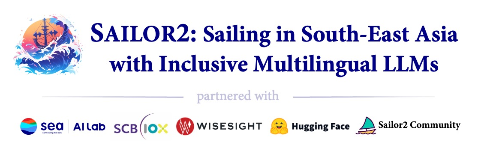

# Sailor2: Sailing in South-East Asia with Inclusive Multilingual LLMs 

[](https://sea-sailor.github.io/blog/sailor2/) &nbsp;&nbsp; [](https://huggingface.co/collections/sail/sailor2-language-models-674d7c9e6b4dbbd9a869906b) &nbsp;&nbsp; [-4F94CD.svg)](https://github.com/sail-sg/sailcraft) &nbsp;&nbsp; [-ffbf00.svg)](https://github.com/sail-sg/sailcompass)


This repository contains the code for Sailor2, a powerful and inclusive open language models for South-East Asia.

Sailor2 is a collaborative project partnered with Sea AI Lab, SCB10X, WiseSight, HuggingFace and the Sailor2 Community.

<div align="center">
  
</div>

> The logo was generated by MidJourney

Sailor2 is a community-driven initiative that brings cutting-edge multilingual language models to South-East Asia (SEA). 
Our research highlights a strong demand for models in the **8B and 20B parameter** range for production use, alongside **1B models** for specialized applications, 
such as speculative decoding and research purposes. 
These models, released under the **Apache 2.0 license**, provide enhanced accessibility to advanced language technologies across the region.


Sailor2 builds upon the foundation of the awesome multilingual model [Qwen 2.5](https://huggingface.co/collections/Qwen/qwen25-66e81a666513e518adb90d9e) and 
is continuously pre-trained on **500B tokens** to support **15 languages** better with a unified model. 
These languages include English, Chinese, Burmese, Cebuano, Ilocano, Indonesian, Javanese, Khmer, Lao, Malay, Sundanese, Tagalog, Thai, Vietnamese, and Waray. 
By addressing the growing demand for diverse, robust, and accessible language models, 
Sailor2 seeks to serve the underserved in SEA areas with open, inclusive, and accessible multilingual LLMs.

Refer to [Sailor2 Homepage](https://sea-sailor.github.io/blog/sailor2/) for more training details.

## Release Check List

> We are working hard to prepare the release of all code, and please stay tuned!

- [ ] Evaluation Code
- [ ] Pre-training Code
- [ ] Post-training Code
- [x] [Base and Chat Models](https://huggingface.co/collections/sail/sailor2-language-models-674d7c9e6b4dbbd9a869906b)


## Requirements
The code of Sailor2 has been in the latest Hugging face transformers and we advise you to install `transformers==4.46.3`.

## Quickstart

Here provides a code snippet to show you how to load the tokenizer and model and how to generate contents.

```python
import torch
from transformers import AutoModelForCausalLM, AutoTokenizer
device = "cuda"

model = AutoModelForCausalLM.from_pretrained(
    'sail/Sailor2-20B-Chat',
    torch_dtype=torch.bfloat16,
    device_map="auto"
)

tokenizer = AutoTokenizer.from_pretrained('sail/Sailor2-20B-Chat')
system_prompt= \
'You are an AI assistant named Sailor2, created by Sea AI Lab. \
As an AI assistant, you can answer questions in English, Chinese, and Southeast Asian languages \
such as Burmese, Cebuano, Ilocano, Indonesian, Javanese, Khmer, Lao, Malay, Sundanese, Tagalog, Thai, Vietnamese, and Waray. \
Your responses should be friendly, unbiased, informative, detailed, and faithful.'

prompt = "Beri saya pengenalan singkat tentang model bahasa besar."
# prompt = "Hãy cho tôi một giới thiệu ngắn gọn về mô hình ngôn ngữ lớn."
# prompt = "ให้ฉันแนะนำสั้น ๆ เกี่ยวกับโมเดลภาษาขนาดใหญ่"

messages = [
    {"role": "system", "content": system_prompt},
    {"role": "user", "content": prompt}
]
text = tokenizer.apply_chat_template(
    messages,
    tokenize=False,
    add_generation_prompt=True
)

model_inputs = tokenizer([text], return_tensors="pt").to(device)
input_ids = model_inputs.input_ids.to(device)

generated_ids = model.generate(
    input_ids,
    max_new_tokens=512,
)

generated_ids = [
    output_ids[len(input_ids):] for input_ids, output_ids in zip(model_inputs.input_ids, generated_ids)
]
response = tokenizer.batch_decode(generated_ids, skip_special_tokens=True)[0]
print(response)
```

# License

Sailor2 is distributed under the terms of the Apache License 2.0. 
No restrict on the research and the commercial use.

## Citation

If you find Sailor2 useful, please cite our work as follows:

```
@misc{sailor2report,
  title  = {Sailor2: Sailing in South-East Asia with Inclusive Multilingual LLM},
  author = {Longxu Dou and Qian Liu and Fan Zhou and Changyu Chen and Zili Wang and Ziqi Jin and Zichen Liu and Tongyao Zhu and Cunxiao Du and Penghui Yang and Haonan Wang and Jiaheng Liu and Yongchi Zhao and Xiachong Feng and Xin Mao and Man Tsung Yeung and Kunat Pipatanakul and Fajri Koto and Min Si Thu and Hynek Kydl{\'\i}{\v{c}}ek and Zeyi Liu and Qunshu Lin and Sittipong Sripaisarnmongkol and Kridtaphad Sae-Khow and Nirattisai Thongchim and Taechawat Konkaew and Narong Borijindargoon and Anh Dao and Matichon Maneegard and Phakphum Artkaew and Zheng-Xin Yong and Quan Nguyen and Wannaphong Phatthiyaphaibun and Hoang H. Tran and Mike Zhang and Shiqi Chen and Tianyu Pang and Chao Du and Xinyi Wan and Wei Lu and Min Lin},
  year   = {2024}
}
```

# Contact Us

If you have any questions, please raise an issue or contact us at [doulx@sea.com](mailto:doulx@sea.com) or [liuqian.sea@gmail.com](mailto:liuqian.sea@gmail.com).
